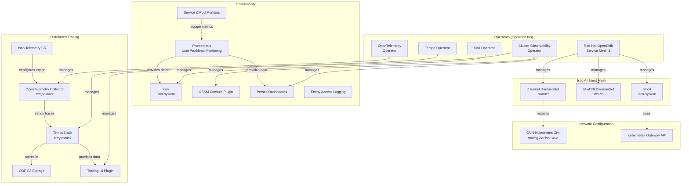

# Service Mesh 3 Installation Guide

## Architecture Overview



## Install the operators

First go to the Operator Hub and install the operators in the OpenShift Console UI or via

```bash
oc apply -f k8s/operators/subscriptions.yml
```

* Kiali Operator
* Red Hat OpenShift Service Mesh 3
* Tempo Operator
* Red Hat build of OpenTelemetry
* Cluster Observability Operator
 
## Install Istio

Install the Kubernetes Gateway API if it's not available (< OpenShift 4.19):

```bash
oc get crd gateways.gateway.networking.k8s.io &> /dev/null || \
  { oc apply -f https://github.com/kubernetes-sigs/gateway-api/releases/download/v1.2.0/standard-install.yaml; }
```

Then we have to configure the OVN-Kubernetes Container Network Interface (CNI) for local gateway mode:

```bash
oc patch networks.operator.openshift.io cluster --type=merge -p '{
  "spec": {
    "defaultNetwork": {
      "ovnKubernetesConfig": {
        "gatewayConfig": {
          "routingViaHost": true
        }
      }
    }
  }
}'
```

This tells OVN-Kubernetes to route pod traffic to the outside world through the node’s host networking stack rather than through OVN’s distributed gateway routing.

Finally we install Istio, Istio-CNI and the ZTunnel for ambient mesh.

```bash
oc apply -k k8s/istio
```

We can verify the installation with `oc get pods -n istio-system` (there should be one pod running), `oc get daemonset -n istio-cni` (istio-cni-nodes should be ready on all nodes) and `oc get daemonset -n ztunnel` (ztunnels on all nodes).

## Observability

Check if the *cluster-monitoring-config* is available:

```bash
oc -n openshift-monitoring get configmap cluster-monitoring-config
```

If yes, enable workload monitoring:

```bash
oc -n openshift-monitoring patch configmap cluster-monitoring-config -p '{"data":{"config.yaml":"enableUserWorkload: true"}}'
```

If not, create it:

```bash
oc apply -f - <<EOF
kind: ConfigMap
apiVersion: v1
metadata:
  name: cluster-monitoring-config
  namespace: openshift-monitoring
data:
  config.yaml: |
    enableUserWorkload: true
EOF
```

Now we should have the prometheus-operator, prometheus-user-workload and thanos-ruler-user-workload running:

```bash
oc get pods -n openshift-user-workload-monitoring
```

Finally we create Service and Pod monitors, enable access logging and install Perses dashboards, Kiali, and the OpenShift Service Mesh console plugin.

```bash
oc apply -k k8s/observability
```

Perses dashboards are available in the OpenShift console under **Observe > Dashboards (Perses)**.

You will have to login to OpenShift again when the console plugin is installed. The URL to Kiali you'll find with:

```bash
echo "https://$(oc get route -n istio-system kiali -o jsonpath='{.spec.host}')"
```

## Distributed Tracing

### Tempostack

Prerequisite: **ODF is installed** on OpenShift. If not, please install or use MinIO as alternative.

Create a bucket claim:

```bash
oc apply -f k8s/tracing/ns.yml
oc apply -f k8s/tracing/bucketclaim.yml
```

Then read the generated access keys and and export them as environment variables:

```bash
export S3_ENDPOINT="http://s3.openshift-storage.svc"
export AWS_ACCESS_KEY_ID=$(oc get secret tempostorage -n tempostack -o jsonpath='{.data.AWS_ACCESS_KEY_ID}' | base64 --decode)
export AWS_SECRET_ACCESS_KEY=$(oc get secret tempostorage -n tempostack -o jsonpath='{.data.AWS_SECRET_ACCESS_KEY}' | base64 --decode)
```

Now create the **TempoStack**:

```bash
envsubst < k8s/tracing/tempostack.yml | oc apply -f -
```

*If you don't have envsubst, replace the values manually in tempostack.yml.*

Create the OpenTelemetry collector, NetworkPolicies, Telemetry resource, and update Istio with tracing configuration:

```bash
oc apply -f k8s/tracing/otel-collector.yml
oc apply -f k8s/tracing/networkpolicies.yml
oc apply -f k8s/tracing/telemetry.yml
oc apply -f k8s/tracing/istio-update.yml
```

The OTel collector sends traces to the TempoStack gateway (port 8080) using OTLP HTTP with bearer token authentication from its ServiceAccount. The `tempostack` namespace has the `istio-discovery: enabled` label so the waypoint can discover the OTel collector service.

### Distributed Tracing UI Plugin

Apply the UIPlugin for the OpenShift console:

```bash
oc apply -f k8s/tracing/uiplugin.yml
```

As a console plugin is installed you'll have to login again to your OpenShift console. In "Observe" is a new entry "Traces".
