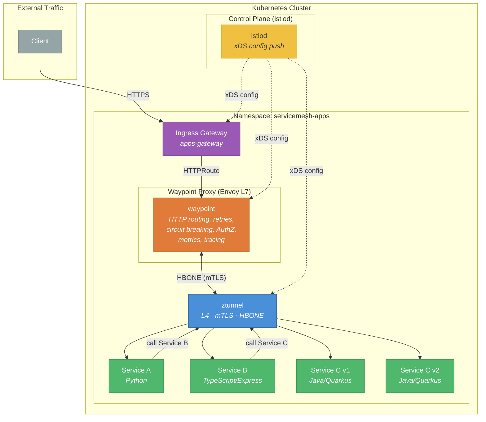

# Using the Service Mesh

We're using the Service Mesh in ambient mode (L4), sidecar mode (L7) and ambient + waypoint proxies (L7).

- **Ztunnel**  
Handles L4 (TCP) traffic management, primarily security. It provides connection-level load balancing, mTLS encryption (using HBONE), and L4 authorization. It does not read HTTP headers.
- **Waypoint Proxy**  
Handles L7 (HTTP/gRPC) traffic management. This is where the advanced, application-aware features are enabled.



## Install the apps

Create the apps namespace, create a pod monitor (every namespace of the mesh needs a pod monitor) and the apps:

```bash
oc apply -k k8s/apps
```

Get the route and check if the apps are available.

```bash
export ROUTE="https://$(oc get route -n servicemesh-apps service-a -o jsonpath='{.spec.host}')"
curl $ROUTE
```

You should see something like

```text
Service A <- Service B <- Service C | v1 | 5vnhc | 1
```

We have 3 apps in a row, app A calls app B and app B calls app C. The response of all downstream calls is added to the response of the first service A. Service C has some additional data in the response like the version, an abbreviated host identifier and a call counter. We'll use these to explore the Service Mesh features later.

## Onboard the apps to the Service Mesh

At the moment, the apps are known to the mesh (because we have the label *istio-discovery: enabled* on the namespace), but not onboarded yet. You can verify that by checking the pods (no sidecars deployed) and the Ztunnel:

```bash
istioctl ztunnel-config workload -n ztunnel
```

The apps in the *servicemesh-apps* namespace are listed, but there's no waypoint proxy and the protocol is **TCP** (should be **HBONE** in ambient mesh). We can label the namespace to add it to the mesh:

```bash
oc label namespace servicemesh-apps istio.io/dataplane-mode=ambient
```

And checking the Ztunnel again, we can see that the protocol switched to **HBONE**.

```bash
istioctl ztunnel-config workload -n ztunnel
```

If you check the Kiali Traffic Graph (Kiali console or integrated Kiali console in your OpenShift UI Console), you can see the service calls. As the Kiali traffic graph is built from real traffic, generate some with

```bash
while true; do curl $ROUTE; sleep 2; done
```

### Check Observability

Now it's time to check out the observability stack.

**Kiali**

In the OpenShift console UI, open 

```text
Service Mesh -> Traffic Graph 
```

Select the servicemesh-apps namespace. You see a graph of the traffic that flows through our services. The blue lines mean all traffic is going through our L4 Ztunnel. If you activate *Security* in the *Display* menu and click on the new icons on the blue lines you see we have mTLS enabled.

**Metrics**

In the OpenShift console UI, open 

```text
Observe -> Metrics
```

Enter the query `istio_tcp_connections_opened_total` and you can see that with the Thanos Querier we can access Istio metrics. At the moment we only have L4 metrics. Later we'll use a Waypoint proxy for L7 which exposes HTTP metrics like `istio_requests_total`.

**Perses Dashboard**

In the OpenShift console UI, open 

```text
Observe -> Perses Dashboards
```

And you can see the TCP traffic.

Also, if you go into 

```text
Workloads -> Deployments
```

and open for example the service-b deployment, you will have a Service Mesh tab with inbound traffic, Kiali information etc..

## L4 Security Features (Ztunnel)

Before we move to L7 with waypoint proxies, let's demonstrate what the ztunnel can already do at L4: enforce strict mTLS and identity-based authorization.

### Strict mTLS

By default, Istio ambient mode uses *permissive* mTLS — mesh workloads accept both plain-text and mTLS traffic. We can enforce that **only** mTLS traffic is allowed by applying a `PeerAuthentication` policy.

Start a temporary curl pod in the `default` namespace (which is NOT enrolled in the mesh) and one in `servicemesh-apps` (which IS in the mesh):

```bash
oc run curl-test -n default --image=curlimages/curl --restart=Never -- sleep 3600
oc run curl-test -n servicemesh-apps --image=curlimages/curl --restart=Never -- sleep 3600
```

Wait a few seconds for the pods to be running, then verify:

```bash
oc get pod curl-test -n default -o jsonpath='{.status.phase}'
oc get pod curl-test -n servicemesh-apps -o jsonpath='{.status.phase}'
```

**Test from outside the mesh (permissive):** The pod in `default` sends plain-text HTTP. In permissive mode (the default) this is **accepted**:

```bash
oc exec curl-test -n default -- curl -s -m 5 -w "\n" http://service-c.servicemesh-apps:8080/health
```

Apply the strict mTLS policy:

```bash
oc apply -f k8s/istiofeatures/mtls/peer-authentication.yml
```

**Test from outside the mesh (strict):** The same curl pod in `default` still sends plain-text HTTP, so it should now be **rejected**:

```bash
oc exec curl-test -n default -- curl -s -m 5 -w "\n" http://service-c.servicemesh-apps:8080/health
```

The connection will be reset because the ztunnel enforces mTLS and rejects plain-text traffic.

**Test from inside the mesh:** Now run the same curl from the pod in `servicemesh-apps`. The ztunnel transparently adds mTLS, so the request **succeeds**:

```bash
oc exec curl-test -n servicemesh-apps -- curl -s -m 5 -w "\n" http://service-c.servicemesh-apps:8080/health
```

You should get a healthy response. This shows that ztunnel provides zero-config mTLS for all enrolled workloads.

Clean up the strict mTLS policy and the curl pod in `default`:

```bash
oc delete -f k8s/istiofeatures/mtls/peer-authentication.yml
oc delete pod curl-test -n default
```

### L4 Authorization Policy

The ztunnel can also enforce authorization at L4 based on **SPIFFE identity** (service account). Our deployments use dedicated service accounts (`service-a`, `service-b`, `service-c`), so the ztunnel can distinguish between callers.

We'll apply a policy that only allows `service-b` to reach `service-c`. Any other caller will be denied.

Apply the authorization policy:

```bash
oc apply -f k8s/istiofeatures/l4-authz/authorization-policy.yml
```

**Test the call chain:** The normal A -> B -> C call should still work because service-b is the one calling service-c:

```bash
curl $ROUTE
```

You should still see the full chain response.

**Test from a curl pod:** The curl pod we created earlier in `servicemesh-apps` uses the `default` service account, not `service-b`. The ztunnel will **deny** the request:

```bash
oc exec curl-test -n servicemesh-apps -- curl -s -m 5 -w "\n" http://service-c.servicemesh-apps:8080/health
```

The connection will be denied by the ztunnel (RBAC: access denied). Only service-b's identity is allowed to reach service-c.

You can also verify in the ztunnel logs that the connection was denied:

```bash
oc logs -n ztunnel -l app=ztunnel --tail=50 | grep "policy rejection"
```

Clean up the authorization policy and the curl pod:

```bash
oc delete -f k8s/istiofeatures/l4-authz/authorization-policy.yml
oc delete pod curl-test -n servicemesh-apps
```

## Waypoint Proxy and Gateway

At the moment we route traffic through a standard OpenShift Route into the mesh. We want to use a Gateway instead. And we only have Service Mesh functionality up to Level 4 in the network stack with our Ztunnel. For L7 features we have to run some waypoint proxies.

### Level 7 features (require Waypoint proxy)

- **Traffic management**  
Advanced HTTP routing, load balancing, circuit breaking, rate limiting, fault injection, retries, timeouts
- **Security**  
Authorization policies based on L7 attributes such as request type or HTTP headers
- **Observability**  
HTTP metrics, access logging and tracing

### Ingress Gateway

Create the Gateway and expose it via OpenShift Route. We delete our old Route as we're using the Gateway from now on.

```bash
oc apply -f k8s/apps_gateway_waypoint/gateway.yml
oc -n servicemesh-apps delete route service-a
```

And we create the HTTPRoute to Service A:

```bash
oc apply -f k8s/apps_gateway_waypoint/service-a-httproute.yml
```

Test the routing:

```bash
export ROUTE="https://$(oc get route -n servicemesh-apps apps-gateway -o jsonpath='{.spec.host}')"
curl $ROUTE
```

#### Testing without Waypoint Proxy

Now generate some traffic with

```bash
while true; do curl $ROUTE; sleep 3; done
```

Open Kiali

```bash
echo "https://$(oc get route -n istio-system kiali -o jsonpath='{.spec.host}')"
```

And check the *Traffic Graph* for the namespace *servicemesh-apps*. You can see that the traffic is routed from the Gateway through all services. The traffic connection lines are blue, which means all traffic is going through the Ztunnel and we have Service Mesh functionality up to L4 of the network stack.

### Waypoint Proxy

For L7 functionality we create a waypoint proxy:

```bash
oc apply -f k8s/apps_gateway_waypoint/waypoint_proxy.yml
```

### Check pods

A waypoint proxy and the ingress gateway are deployed next to the apps:

```bash
oc get pod -n servicemesh-apps
```

Label the namespace to enroll all services of the namespace to use the waypoint:

```bash
oc label namespace servicemesh-apps istio.io/use-waypoint=waypoint
```

As apps may use a persistent HTTP connection for downstream service calls, restart the deployments to make sure they will use the waypoint proxy.

```bash
oc rollout restart deployment/service-a -n servicemesh-apps
oc rollout restart deployment/service-b -n servicemesh-apps
```

Istio is sending traffic from the gateway directly to the destination, if not instructed otherwise. We have to label the service the gateway uses to enable **ingress waypoint routing**:

```bash
oc -n servicemesh-apps label service service-a istio.io/ingress-use-waypoint=true
```

#### Testing with Waypoint Proxy

Again, generate some traffic with

```bash
while true; do curl $ROUTE; sleep 3; done
```

In Kiali wait for the traffic data coming in and check the *Traffic Graph* for the namespace *servicemesh-apps*. You can see that the traffic is routed from the Gateway through all services. The traffic connection lines are changing to green, which means the traffic is going through the waypoint proxy and we have Service Mesh functionality up to L7 of the network stack.

Also check the other observability dashboards we have already seen before. For example, the `istio_requests_total` query now has datapoints.

## Distributed Tracing

Distributed Tracing operates by adding trace and span IDs to the HTTP header. So with L4 ambient mesh we do not get tracing data from the Service Mesh - but as we have a Waypoint proxy now, distributed tracing functionality is added. The Service Mesh adds tracing headers automatically on incoming requests if there aren't any. To make tracing of the full path visible, apps have to foward the tracing headers when doing downstream service calls, see the [Istio docs](https://istio.io/latest/docs/tasks/observability/distributed-tracing/overview/#building-applications-to-support-trace-context-propagation).

As our apps do that and our observability stack (Tempo with Distributed Tracing UI Plugin, OpenTelemetry) is set up and Istio configured to use it, we can explore the Distributed Tracing Dashboard in the OpenShift Console UI:

```text
Observe -> Traces -> Tempo instance "tempostack" -> Tenant "dev"
```

## Canary Release

A canary release lets you roll out a new version of a service gradually, shifting traffic in controlled increments so you can observe behaviour before committing fully. We'll use the waypoint proxy and Gateway API `HTTPRoute` to steer traffic between service-c v1 and v2.

### Preparation — version-specific Services

The existing `service-c` Service selects **all** pods with `app: service-c` regardless of version. To split traffic we need two additional Services that each select a single version:

```bash
oc apply -f k8s/istiofeatures/canary/0-service-c-versions.yml
```

This creates `service-c-v1` (selects `version: v1`) and `service-c-v2` (selects `version: v2`).

### Step 1 — Pin all traffic to v1

Before deploying the new version, pin traffic explicitly to v1. This creates an `HTTPRoute` attached to the `service-c` Service (processed by the waypoint proxy) that sends 100 % of requests to `service-c-v1`:

```bash
oc apply -f k8s/istiofeatures/canary/1-httproute-v1.yml
```

Verify that everything still works:

```bash
curl $ROUTE
```

You should see `v1` in the response:

```text
Service A <- Service B <- Service C | v1 | 5vnhc | 42
```

### Step 2 — Deploy service-c v2

Now deploy the v2 version alongside v1:

```bash
oc apply -f k8s/istiofeatures/canary/c-v2-deploy.yml
```

Wait for the pod to be ready:

```bash
oc rollout status deployment/service-c-v2 -n servicemesh-apps
```

Even though v2 is running, the HTTPRoute still sends 100 % of traffic to v1. Confirm by generating some requests:

```bash
for i in $(seq 1 10); do curl $ROUTE; done
```

Every response should show `v1`.

### Step 3 — Shift 10 % of traffic to v2

Start small — send 10 % of requests to v2 while keeping 90 % on v1:

```bash
oc apply -f k8s/istiofeatures/canary/2-httproute-90-10.yml
```

Generate traffic and observe the version in the responses:

```bash
while true; do curl $ROUTE; sleep 2; done
```

Roughly 1 in 10 requests should now show `v2`. Check Kiali for a visual split:

```text
Service Mesh -> Traffic Graph -> Display -> Check "Traffic Distribution"
```

### Step 4 — Shift 50 % of traffic to v2

If v2 looks healthy, increase the canary to 50/50:

```bash
oc apply -f k8s/istiofeatures/canary/3-httproute-50-50.yml
```

You should see an even mix of `v1` and `v2` responses.

### Step 5 — Complete the rollout to v2

Once you're confident, send 100 % of traffic to v2:

```bash
oc apply -f k8s/istiofeatures/canary/4-httproute-v2.yml
```

All responses should now show `v2`.

### Cleanup

Remove the canary HTTPRoute and the version-specific Services. Scale down or delete the v1 deployment if no longer needed:

```bash
oc delete -f k8s/istiofeatures/canary/4-httproute-v2.yml
oc delete -f k8s/istiofeatures/canary/0-service-c-versions.yml
oc delete -f k8s/istiofeatures/canary/c-v2-deploy.yml
```

Traffic will return to normal round-robin across whichever service-c pods are running behind the original `service-c` Service.

## Circuit Breaker

A circuit breaker protects your system by detecting unhealthy endpoints and temporarily removing them from the load-balancing pool (outlier detection). Combined with retries, it ensures users never see errors from a single crashed instance.

We'll demonstrate this on service-c-v1 (already deployed) with 2 replicas. One pod will be "crashed" via its `/crash` endpoint while `/health` keeps returning UP — so Kubernetes still considers the pod ready, but the business endpoint returns 500.

### Preparation — Scale service-c-v1

Scale service-c-v1 to 2 replicas so the waypoint proxy round-robins between them:

```bash
oc scale deployment/service-c-v1 -n servicemesh-apps --replicas=2
```

Verify both pods are running:

```bash
oc get pods -n servicemesh-apps -l app=service-c,version=v1
```

Generate some traffic and confirm both pods handle requests — the abbreviated host ID in the response alternates:

```bash
for i in $(seq 1 10); do curl $ROUTE; done
```

### Step 1 — Crash one pod (no circuit breaker)

Pick one of the service-c pods and crash it via port-forwarding:

```bash
export CRASH_POD=$(oc get pods -n servicemesh-apps -l app=service-c,version=v1 -o jsonpath='{.items[0].metadata.name}')
oc port-forward -n servicemesh-apps $CRASH_POD 8080:8080 &
```

```bash
curl http://localhost:8080/crash
kill %1
```

Now generate traffic. Roughly half the requests fail because the waypoint proxy round-robins between the healthy and crashed pods:

```bash
for i in $(seq 1 20); do curl $ROUTE; sleep 1; done
```

You should see a mix of successful responses and `INTERNAL_SERVER_ERROR`. This is the problem we want to solve.

### Step 2 — Apply the Circuit Breaker

Apply a `DestinationRule` with outlier detection. It ejects an endpoint after a single 5xx error, keeps it out for 30 seconds, and checks every 5 seconds:

```bash
oc apply -f k8s/istiofeatures/circuit-breaker/1-destination-rule.yml
```

Generate traffic again:

```bash
for i in $(seq 1 20); do curl $ROUTE; sleep 1; done
```

You may still see **one** error (the first 5xx triggers the ejection), but all subsequent requests go only to the healthy pod. The circuit breaker has opened for the crashed endpoint.

### Step 3 — Add Retries (zero errors for the user)

To eliminate even that initial error, add a retry policy. The waypoint retries failed requests up to 3 times on 5xx responses:

```bash
oc apply -f k8s/istiofeatures/circuit-breaker/2-retry-virtualservice.yml
```

Generate traffic:

```bash
for i in $(seq 1 20); do curl $ROUTE; sleep 1; done
```

No errors at all. If a request hits the crashed pod it is retried transparently on the healthy one.

Explorer the Kiali Traffic Graph to see the Circuit Breaker and Retry applied and the information reported about the HTTP responses.

### Step 4 — Repair and observe recovery

Repair the crashed pod:

```bash
oc port-forward -n servicemesh-apps $CRASH_POD 8888:8080 &
```

```bash
curl http://localhost:8888/repair
kill %1
```

The circuit breaker ejects endpoints for a base period of 30 seconds (increasing with repeated ejections). Wait about a minute for the ejection to expire, then generate traffic:

```bash
for i in $(seq 1 20); do curl $ROUTE; sleep 1; done
```

The host ID alternates again — both pods are back in rotation. The circuit has closed and traffic flows to all healthy endpoints.

### Cleanup

```bash
oc delete -f k8s/istiofeatures/circuit-breaker/2-retry-virtualservice.yml
oc delete -f k8s/istiofeatures/circuit-breaker/1-destination-rule.yml
oc scale deployment/service-c-v1 -n servicemesh-apps --replicas=1
```

## Traffic Mirroring

Traffic mirroring (also called shadowing) sends a copy of live traffic to a second service without affecting the primary request path. The mirrored requests are fire-and-forget — responses from the mirror target are discarded. This is useful for testing a new version with real production traffic before routing actual users to it.

We'll mirror 100 % of the traffic that goes to service-c-v1 to a freshly deployed service-c-v2.

### Preparation — Deploy v2 and version-specific Services

We need the version-specific Services (`service-c-v1`, `service-c-v2`) and the v2 Deployment. These are the same resources we used in the canary demo:

```bash
oc apply -f k8s/istiofeatures/canary/0-service-c-versions.yml
oc apply -f k8s/istiofeatures/canary/c-v2-deploy.yml
```

Wait for v2 to be ready:

```bash
oc rollout status deployment/service-c-v2 -n servicemesh-apps
```

### Step 1 — Apply the mirror HTTPRoute

The `HTTPRoute` attaches to the `service-c` Service (processed by the waypoint proxy), routes all traffic to `service-c-v1`, and mirrors a copy to `service-c-v2`:

```bash
oc apply -f k8s/istiofeatures/mirroring/1-mirror-httproute.yml
```

### Step 2 — Generate traffic and verify

First, check the v2 call counter before sending any traffic:

```bash
export V2_POD=$(oc get pods -n servicemesh-apps -l app=service-c,version=v2 -o jsonpath='{.items[0].metadata.name}')
oc port-forward -n servicemesh-apps $V2_POD 8889:8080 &
curl http://localhost:8889/
kill %1
```

The counter should be at 1 (this first call). Now generate traffic through the normal route:

```bash
for i in $(seq 1 10); do curl $ROUTE; sleep 1; done
```

All responses come from **v1** only — the user never sees v2 responses because mirrored traffic is fire-and-forget.

Now check the v2 call counter again:

```bash
oc port-forward -n servicemesh-apps $V2_POD 8889:8080 &
curl http://localhost:8889/
kill %1
```

The counter should have jumped to 11 (1 from our initial check + 10 mirrored requests) — proving v2 received copies of the live traffic even though no user-facing response ever came from v2.

In Kiali, you can observe the mirrored traffic flow as well:

```text
Service Mesh -> Traffic Graph -> Display -> Check "Traffic Distribution"
```

### Cleanup

```bash
oc delete -f k8s/istiofeatures/mirroring/1-mirror-httproute.yml
oc delete -f k8s/istiofeatures/canary/c-v2-deploy.yml
oc delete -f k8s/istiofeatures/canary/0-service-c-versions.yml
```

---

## Congratulations, you're done!

You have successfully explored Istio Service Mesh on OpenShift in ambient mode — from L4 security with the ztunnel all the way to L7 traffic management with waypoint proxies.

> **Why do we mix Gateway API and Istio APIs?**
>
> You may have noticed that we used Gateway API `HTTPRoute` for canary releases and traffic mirroring, but Istio `DestinationRule` and `VirtualService` for the circuit breaker and retries. If you're familiar with sidecar-based Istio, you'd expect `VirtualService` + `DestinationRule` for everything.
>
> In ambient mode, **Gateway API is the recommended API for traffic routing** and replaces `VirtualService` wherever it can:
>
> | Feature | API | Why |
> |---|---|---|
> | Weighted routing (canary) | `HTTPRoute` | Core Gateway API — `backendRefs` with `weight` |
> | Traffic mirroring | `HTTPRoute` | Core Gateway API — `RequestMirror` filter |
> | Circuit breaking / outlier detection | `DestinationRule` | No Gateway API equivalent exists |
> | Retries | `VirtualService` | Gateway API retry support is still experimental |
>
> The rule of thumb: **use Gateway API when it covers your use case, fall back to Istio APIs for the gaps.** The waypoint proxy processes both — they work side by side.

