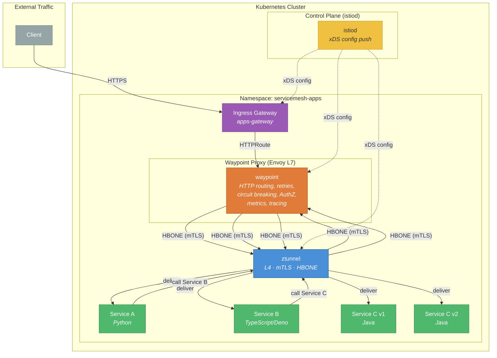

# Istio Ambient Mode with Waypoint Proxies

```mermaid
graph TB
    subgraph external["External Traffic"]
        client["Client"]
    end

    subgraph cluster["Kubernetes Cluster"]
        subgraph cp["Control Plane (istiod)"]
            istiod["istiod<br/><i>xDS config push</i>"]
        end

        subgraph ns["Namespace: servicemesh-apps"]
            gw["Ingress Gateway<br/><i>apps-gateway</i>"]

            subgraph wp["Waypoint Proxy (Envoy L7)"]
                waypoint["waypoint<br/><i>HTTP routing, retries,<br/>circuit breaking, AuthZ,<br/>metrics, tracing</i>"]
            end

            ztunnel["ztunnel<br/><i>L4 · mTLS · HBONE</i>"]
            podA["Service A<br/><i>Python</i>"]
            podB["Service B<br/><i>TypeScript/Deno</i>"]
            podC1["Service C v1<br/><i>Java</i>"]
            podC2["Service C v2<br/><i>Java</i>"]
        end
    end

    client -->|"HTTPS"| gw
    gw -->|"HTTPRoute"| waypoint

    waypoint -->|"HBONE (mTLS)"| ztunnel
    ztunnel -->|"deliver"| podA
    podA -->|"call Service B"| ztunnel
    ztunnel -->|"HBONE (mTLS)"| waypoint

    waypoint -->|"HBONE (mTLS)"| ztunnel
    ztunnel -->|"deliver"| podB
    podB -->|"call Service C"| ztunnel
    ztunnel -->|"HBONE (mTLS)"| waypoint

    waypoint -->|"HBONE (mTLS)"| ztunnel
    ztunnel -->|"deliver"| podC1
    ztunnel -->|"deliver"| podC2

    istiod -.->|"xDS config"| ztunnel
    istiod -.->|"xDS config"| waypoint
    istiod -.->|"xDS config"| gw

    classDef ztunnelStyle fill:#4a90d9,stroke:#2c5f8a,color:#fff
    classDef waypointStyle fill:#e07b39,stroke:#b5612d,color:#fff
    classDef podStyle fill:#50b86c,stroke:#3a8a50,color:#fff
    classDef gwStyle fill:#9b59b6,stroke:#7d3c98,color:#fff
    classDef cpStyle fill:#f0c040,stroke:#c9a030,color:#333
    classDef clientStyle fill:#95a5a6,stroke:#7f8c8d,color:#fff

    class ztunnel ztunnelStyle
    class waypoint waypointStyle
    class podA,podB,podC1,podC2 podStyle
    class gw gwStyle
    class istiod cpStyle
    class client clientStyle
```
