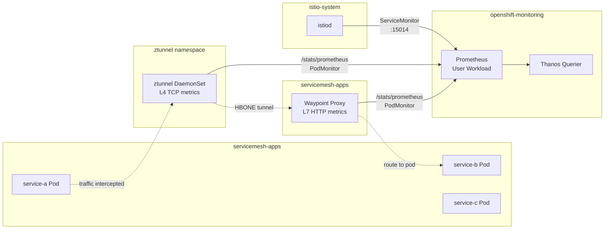
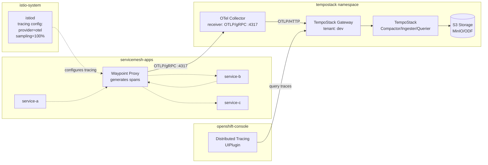
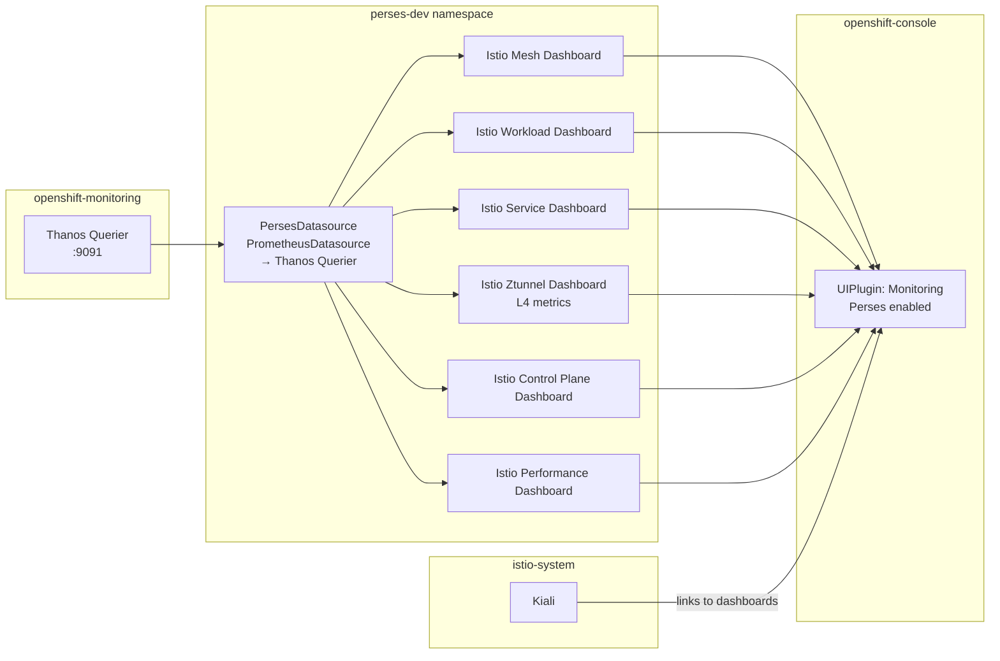
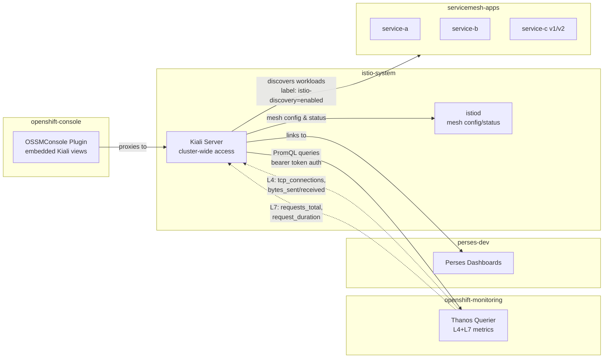

# Observability Components Analysis

This document describes the observability stack deployed alongside the Istio ambient mode service mesh for the `servicemesh-apps` namespace (services A -> B -> C).

---

## 1. Metrics (Prometheus + OpenShift User Workload Monitoring)

Istio's ambient mode exposes metrics at two layers. The **ztunnel** (L4 proxy on every node) emits TCP-level metrics — bytes sent/received, connection counts, connection duration. The **waypoint proxy** (L7, Envoy-based) emits HTTP-level metrics — request count, request duration, response codes, request size. Both expose a `/stats/prometheus` endpoint that is scraped by OpenShift's built-in Prometheus via PodMonitor resources deployed in `istio-system`, `ztunnel`, and `servicemesh-apps` namespaces. A ServiceMonitor also scrapes istiod (the control plane). All metrics flow to the Thanos Querier for unified querying.

**L4 metrics (ztunnel):** `istio_tcp_connections_opened_total`, `istio_tcp_connections_closed_total`, `istio_tcp_sent_bytes_total`, `istio_tcp_received_bytes_total`

**L7 metrics (waypoint proxy):** `istio_requests_total`, `istio_request_duration_milliseconds`, `istio_request_bytes`, `istio_response_bytes`

---

## 2. Distributed Tracing (Tempo + OpenTelemetry Collector)

Distributed tracing captures end-to-end request paths across services A -> B -> C. Istio is configured with `enableTracing: true` and an OpenTelemetry extension provider pointing to the OTel Collector. The waypoint proxy generates trace spans for each L7 request and exports them via OTLP/gRPC (port 4317) to the OTel Collector in the `tempostack` namespace. The OTel Collector forwards traces via OTLP/HTTP to the TempoStack gateway (multi-tenant, tenant `dev`). TempoStack stores traces in S3-compatible object storage (MinIO/ODF). A `UIPlugin` of type `DistributedTracing` exposes traces in the OpenShift console. Sampling is set at 100% for the workshop.

> **Note:** Only the **waypoint proxy** (L7) generates trace spans. The ztunnel (L4) does not participate in distributed tracing since it operates below HTTP.

---

## 3. Perses Dashboards (Visualization)

Perses is the dashboard engine integrated into OpenShift via the Cluster Observability Operator. It provides pre-built Istio dashboards visualizing both L4 and L7 metrics. A `PersesDatasource` connects to the Thanos Querier (same Prometheus data used by metrics collection). The `UIPlugin` of type `Monitoring` with Perses enabled injects dashboards into the OpenShift console. Six dashboards are deployed covering mesh overview, workload details, service details, ztunnel (L4), control plane, and performance. Kiali also links directly to these Perses dashboards for contextual drill-down.

**Dashboards deployed:**

| Dashboard | Focus |
|-----------|-------|
| Istio Mesh Dashboard | Global mesh overview |
| Istio Workload Dashboard | Per-workload L7 metrics |
| Istio Service Dashboard | Per-service L7 metrics |
| Istio Ztunnel Dashboard | L4 TCP metrics |
| Istio Control Plane Dashboard | istiod health |
| Istio Performance Dashboard | Resource usage |

---

## 4. Kiali (Service Mesh Topology & Observability Console)

Kiali provides real-time service mesh topology visualization, traffic flow animation, health indicators, and configuration validation. It queries Prometheus (via Thanos Querier) for both L4 and L7 metrics to render service graphs and traffic rates. It integrates with Perses dashboards for detailed metric drill-down and can display distributed traces. The OSSMConsole plugin embeds Kiali views directly into the OpenShift console. Kiali uses `discoverySelectors` to watch only namespaces labeled `istio-discovery: enabled` (i.e., `servicemesh-apps`). It has cluster-wide access for full topology visibility.

---

## Summary: End-to-End Data Flow

| Layer | Source | Metrics Type | Collector | Storage | Visualization |
|-------|--------|-------------|-----------|---------|--------------|
| L4 | ztunnel | TCP connections, bytes | Prometheus (PodMonitor) | Thanos | Perses (Ztunnel Dashboard), Kiali |
| L7 | Waypoint Proxy | HTTP requests, duration, codes | Prometheus (PodMonitor) | Thanos | Perses (Workload/Service/Mesh), Kiali |
| L7 | Waypoint Proxy | Trace spans (OTLP) | OTel Collector | TempoStack (S3) | OpenShift Tracing UIPlugin, Kiali |
| Control Plane | istiod | Pilot metrics | Prometheus (ServiceMonitor) | Thanos | Perses (Control Plane Dashboard) |
